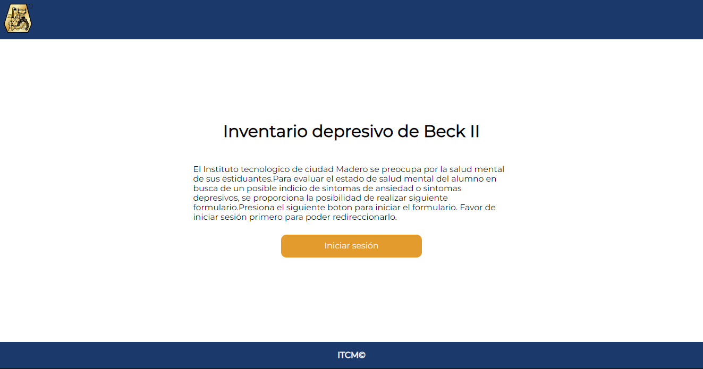
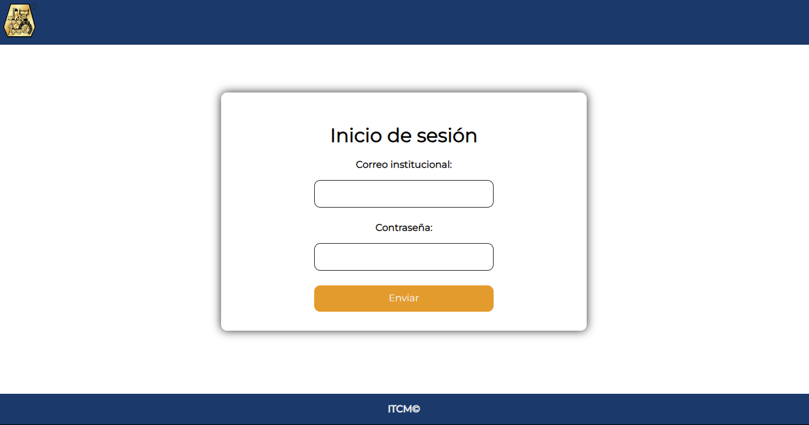
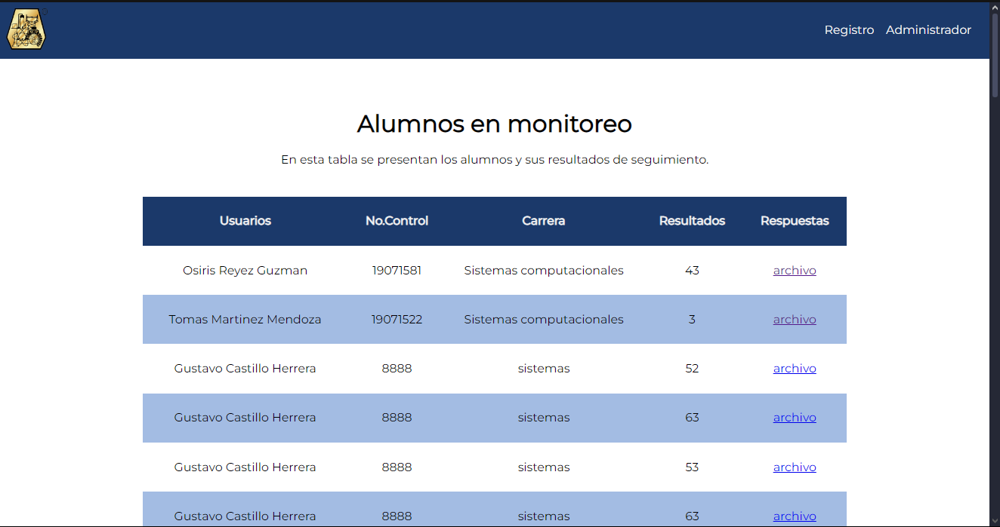
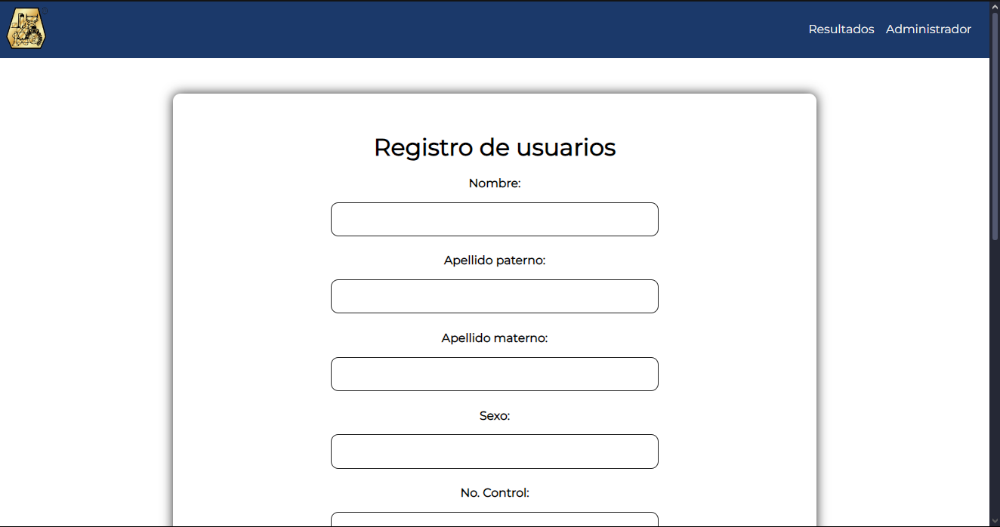
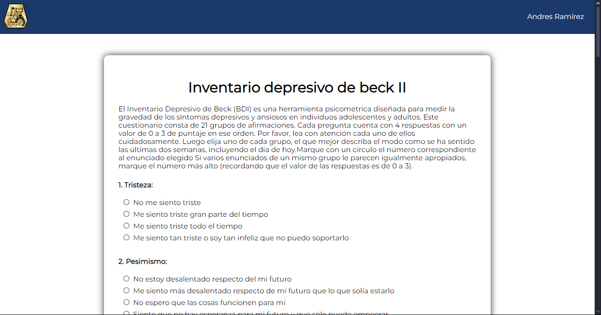

# SISTEMA BECK II DEL INTITUTO TECNOLÓGICO DE CIUDAD MADERO.

### VERSIÓN EN ESPAÑOL

Para este proyecto se me encomendó desarrollar un módulo para la plataforma [SII](http://sii.cdmadero.tecnm.mx) perteneciente a la universidad donde estudié, el [Instituto Tecnológico de Ciudad
Madero](https://www.cdmadero.tecnm.mx), con el fin de llevar un seguimiento psicológico de los alumnos mediante una encuesta y generar PDFs de cada respuesta, esto para poder llevar una bitacora sobre la salud psicológica del alumnado del [ITCM](https://www.cdmadero.tecnm.mx).

Las tecnologías utilizadas en la elaboración de este proyecto fueron:

- PUG - Motor de plantillas para maquetado de la página.
- CSS - Estilos y animaciones.
- JavaScript - Validaciones de formulario y de la lógica de la aplicación.
- Node.JS - Entorno de ejecución en tiempo real de JavaScript y dependencias del proyecto tales como bcryptjs, coockie-parser, jsonwebtoken, nodemailer entre otras.
- Express.JS - Framework de desarrollo de JavaScript en Node.JS
- MySQL - Sistema gestor de base de datos.

# BECK II SYSTEM OF THE INSTITUTO TECNOLÓGICO DE CIUDAD MADERO.

### ENGLISH VERSION

In this project I had the responsibility of developing a module for the [SII](http://sii.cdmadero.tecnm.mx) platform belonging to the university where I studied, the [Instituto Tecnológico de Ciudad Madero](https://www.cdmadero.tecnm.mx), with the purpose of carrying out psychological monitoring of its students through a survey and generating PDFs of each survey, all this to have a log about the psychological health of [ITMC](https://www.cdmadero.tecnm.mx) students.

The technologies used in the develpment of this project were:

- PUG - Template engine for page layout.
- CSS - Styles and animations.
- JavaScript - Form validations and application logic.
- Node.JS - JavaScript real-time execution environment and project dependencies such as bcryptjs, coockie-parser, jsonwebtoken, nodemailer among others.
- Express.JS - JavaScript development framework in Node.JS
- MySQL - Database management system.

# Created by Andrés Mendoza.

